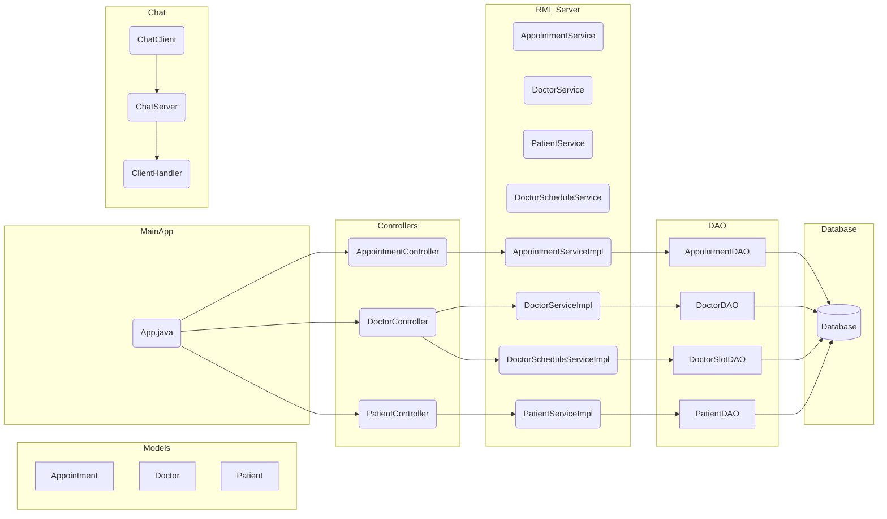

# HospitalSystem – Système Distribué (RMI + Chat + DAO + JDBC)

Ce projet est une application répartie modulaire pour la gestion d’un système hospitalier.  
Elle combine plusieurs technologies : **RMI Java**, **Sockets (Chat)**, **DAO/JDBC**, et une architecture claire par packages.

---

## 📌 Table des matières
1. [Structure du projet](#structure-du-projet)
2. [Fonctionnalités](#fonctionnalités)
3. [Architecture globale](#architecture-globale)
4. [Diagramme de classes](#diagramme-de-classes)
5. [RMI : Architecture et rôle](#rmi--architecture-et-rôle)
6. [Chat multi‑clients (Socket)](#chat-multi-clients-socket)
7. [Base de données](#base-de-données)
8. [Instructions de lancement](#instructions-de-lancement)
9. [Crédits](#crédits)

---

## 📁 Structure du projet

```
HospitalSystem/src
├── chat_server
│   ├── ChatServer.java
│   └── ClientHandler.java
├── client_app
│   ├── chat
│   │   └── ChatClient.java
│   ├── ClientMain.java
│   └── rmi
│       └── RMIClient.java
├── common
│   ├── dao
│   ├── database
│   ├── models
│   └── utils
├── hospitalsystem
│   ├── App.java
│   └── controllers
└── rmi_server
    ├── services (interfaces)
    ├── impl
    └── RMIServer.java
```

---

## 🚀 Fonctionnalités

### ✔ Gestion Hospitalière
- Gestion **Doctors**
- Gestion **Patients**
- Gestion **Appointments**
- Disponibilités (Scheduling)

### ✔ Architecture distribuée via **RMI**
- Communication distante (client ↔ serveur RMI)
- Services : DoctorService, PatientService, AppointmentService…

### ✔ Chat en temps réel (sockets)
- Serveur multi‑clients TCP
- Broadcast messages

### ✔ DAO + JDBC
- Accès base MySQL
- Classe Database centralisée

---

## 🧩 Architecture Globale

### 🟦 1. **Models**
Objets métier : `Doctor`, `Patient`, `Appointment`.

### 🟩 2. **DAO**
Accès JDBC via `Database`.

### 🟨 3. **RMI Server**
Expose les services distants :
- AppointmentService
- DoctorService
- PatientService
- DoctorScheduleService

### 🟧 4. **Client Application**
Utilise RMI + Chat.

### 🟥 5. **Controllers**
Pilotent les DAO ou services.

---

## 📘 Diagramme de classes (Mermaid)



---

## 🛰 RMI : Architecture et rôle

### Serveur RMI :
- Initialise `Registry`
- Enregistre les services (`bind`)
- Les clients appellent les méthodes distantes

### Clients RMI :
- Lookup du service :  
  ```java
  DoctorService stub = (DoctorService) registry.lookup("DoctorService");
  ```
- Appels distants transparents

---

## 💬 Chat Multi‑clients

Basé sur : `ServerSocket`, `Socket`, threads.

- `ChatServer` écoute
- Chaque client créé un `ClientHandler`
- Broadcast messages à tous

---

## 🗄 Base de Données

Classe centrale :

```
common/database/Database.java
```

Fournit :
- `Connection`
- Gestion du singleton

Tables recommandées :
- `doctor`
- `patient`
- `appointment`
- `doctor_slots`

---

## ▶️ Instructions de lancement

### 1️⃣ Compiler avec Maven :
```bash
mvn clean compile
```

### 2️⃣ Lancer serveur RMI :
```bash
java rmi_server/RMIServer
```

### 3️⃣ Lancer Client RMI :
```bash
java client_app/rmi/RMIClient
```

### 4️⃣ Lancer le serveur chat :
```bash
java chat_server/ChatServer
```

### 5️⃣ Lancer client chat :
```bash
java client_app/chat/ChatClient
```

---

## 👤 Crédits
Projet réalisé par **Omar Belfeki && Mouhamed Aziz Mazghouni** (LSI3 1.1).  
FSS Project (Belfeki License): Do Not Touch.
---
